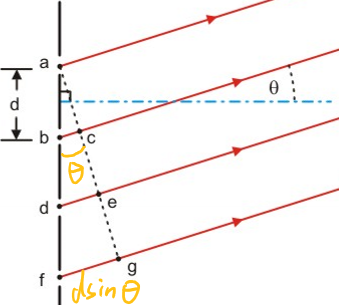

# Atoms

## Measuring Light Wavelengths

If light goes through small slits, it emerges in circular waves.

If the slit spacing is $d$, the path-length difference between slits is $\triangle x = d \sin \theta$.

If the wavelength is $\lambda$, the waves will be **in phase** if $\triangle x = n \lambda, \forall n \in \mathbb{Z}$.

Note that it is different from *Bragg diffraction*, the $\theta$ here is measured from the **normal**, not the surface.

### Diffraction Facts

$$
d \sin \theta = n \lambda \implies \sin \theta = n\frac{ \lambda}{d}
$$

- If $d>>\lambda$, $\sin \theta \approx \theta$ since the angle is small thus diffraction is invisible.
- If $\lambda > d$, $\sin \theta > 1$ and no diffraction occurs.

## Spectral Emission Lines

Hot dense objects emit black-body radiation, which is a continuous spectrum that only depends on temperature and not the material/substance.

However, for low density gases in electrical discharge tubes,they emit at only a few discrete wavelengths. This is called **line emission**.

Interestingly, the gases can absorb the same wavelengths they emit. This is called **line absorption**.

### Absorption and Emission Bands

Absorption and emission are due to *vibrations of electrons* in the atoms. Electrons have low mass, thus the $\omega = \sqrt{\frac{k}{m}}$ is high, and the energy levels are quantized.

Cooler atoms form molecules. The atoms in molecules can also vibrate. With the much larger mass, the vibrational frequency is much lower.

Molecules can also rotate. It turns out to give absorption lines that are so close together that they look continuous and they are called **absorption bands**.

### Hydrogen Spectrum

#### Hydrogen Emission lines

John Balmer found that the wavelengths of the hydrogen emission lines are given by

$$
\lambda = B \frac{n^2}{n^2 - 2^2}
$$

where $B = 364.50682 \text{ nm}$ and $n\in \mathbb{N}, n > 2$.

Later, they find that the formula needs to be modified to fit in ultraviolet and infrared regions. It works for only visible light for now.

For $B=364.50682 \text{ nm}, n>m$:

$$
\begin{align*}
\lambda &= \frac{B}{4}\frac{n^2m^2}{n^2 - m^2} \\
m &=1 : \text{Lyman series for ultraviolet} \\
m &=2 : \text{Balmer series for visible} \\
m &=3 : \text{Paschen series for infrared}
\end{align*}