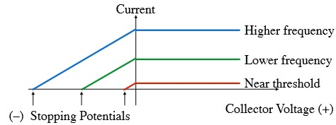

# Photons

Electromagnetic waves, in fact, can only have certain **discrete/quntized** amplitudes. 
- Photons have energy $E = hf$, where $h$ is Planck's constant and $f$ is the frequency of the wave.
- Photons also have momentum satisfying $E = pc$ since $E^2 = p^2c^2 + m^2c^4$ and $m = 0$ for photons. Thus $p = \frac{E}{c} = \frac{hf}{c}$.

## Blackbody Radiation

### Rayleigh-Jeans Law

$$
\begin{align*}
dI_{RJ}(f) = \frac{2f^2}{c^2}kTdf \\
dI_{RJ}(\lambda) = \frac{2 c}{\lambda^4}kT d\lambda
\end{align*}
$$

### Planck's Law

$$
\begin{align*}
dI(f) = \frac{2 hf^3}{c^3}\frac{1}{e^{\frac{hf}{kT}}-1}df \\
dI(\lambda) = \frac{2 hc^2}{\lambda^5}\frac{1}{e^{\frac{hc}{\lambda kT}}-1}d\lambda
\end{align*}
$$

### Quantization of Energy

Boltzmann factor: $e^{-\frac{E}{kT}}$ where $E = hf$.

- At low frequencies, $hf << kT$, thus the energy steps are very small. Then it can be treated as a continuous spectrum.
- At high frequencies, $hf >> kT$, thus the energy steps are very large. Then it can be treated as a discrete spectrum.

However, the energy depends not only on the wave amplitude but also on the dimensions of the box. 

## Photoelectric Effect

- The photoelectric effect is the emission of electrons from a material when light of a certain frequency shines on it.
- Current emitted is proportional to the intensity of the light.
- Positive voltage increase the current to a **saturation current** (plateau).
- Negative voltage which repels the electrons decreases the current. If the voltage is too high, the current will be zero (Stopping potential).

### Einstein's Explanation

Einstein thinks that the stopping potential implies that there was a ejected electron kinetic energy: $E_{\text{max}}=qV_{\text{stop}}$. The dependence of the stopping potential on the frequency of the light implies that the energy of the ejected electron is increased with the frequency of the light. Then he guessed with Planck's work $E = hf$ that:
$$
qV_{\text{stop}} = hf - q\phi_{\text{work}}
$$
where $\phi$ is the work function of the material. The threshold frequency is given by: $hf_{\text{threshold}} = q\phi_{\text{work}}$. The work function is a property of the material in units of volts.