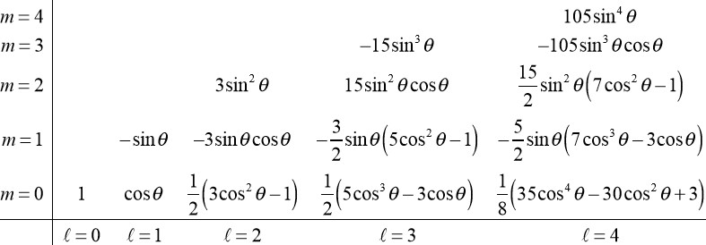

# Schrodigner Equation in 3D

$$
\begin{align*}
i\hbar \frac{\partial }{\partial t}\psi(x,y,z,t) &= -\frac{\hbar^2}{2m} \nabla^2 \psi(x,y,z,t) + V(x,y,z,t) \psi(x,y,z,t)\\
i\hbar \frac{\partial }{\partial t}\psi(\vec{x},t) &= -\frac{\hbar^2}{2m} \nabla^2 \psi(\vec{x},t) + V(\vec{x},t) \psi(\vec{x},t)
\end{align*}
$$

Make time-independent:

$$
\begin{align*}
\frac{-\hbar^2}{2m} \frac{\nabla^2 f(\vec{x})}{f(\vec{x})} + V(\vec{x}) &= E\\
\frac{-\hbar^2}{2m} \nabla^2 f(\vec{x}) + V(\vec{x}) f(\vec{x}) &= E f(\vec{x})\\
\frac{-\hbar^2}{2m} \nabla^2 \psi(\vec{x}) + V(\vec{x}) \psi(\vec{x}) &= E \psi(\vec{x})
\end{align*}
$$

## Particle in 3D Box

Assume $V(\vec{x}) = 0$ for $0 < x < a$, $0 < y < b$, $0 < z < c$, otherwise $\infty$.

Solve for the time-independent Schrodinger equation:

$$
\psi(\vec{x}) = A \sin(k_x x) \sin(k_y y) \sin(k_z z)
$$

At the boundaries

$$
\begin{align*}
x=a &\impliedby k_x = \frac{n_x \pi}{a}\\
y=b &\impliedby k_y = \frac{n_y \pi}{b}\\
z=c &\impliedby k_z = \frac{n_z \pi}{c}
\end{align*}
$$

Thus we get the energy levels:

$$
E = \frac{\hbar^2 \pi^2}{2m} \left( \frac{n_x^2}{a^2} + \frac{n_y^2}{b^2} + \frac{n_z^2}{c^2} \right)
$$

### Cubical Box

The cubical box has $a=b=c=w$:

$$
E = \frac{\hbar^2 \pi^2}{2m} \left( \frac{n_x^2 + n_y^2 + n_z^2}{w^2} \right) = \frac{\hbar^2 \pi^2}{2mw^2} \left( {n_x^2 + n_y^2 + n_z^2}\right)
$$

- the lowest state is $n_x=n_y=n_z=1$ with energy $E_{111} = \frac{3\hbar^2 \pi^2}{2mw^2}$
- the next state is one of $n=2$ and the others are $1$ with energy $E_{211} = E_{121} = E_{112} = \frac{6\hbar^2 \pi^2}{2mw^2}$. These different wave functions with the same energy are called **degeneracy**.
- Then the next is $n=2$ for two of the $n$'s and $1$ for the other with energy $E_{221} = E_{212} = E_{122} = \frac{9\hbar^2 \pi^2}{2mw^2}$.
- The next is $n=2$ for one of the $n$'s and $1$ for the other two with energy $E_{222} = \frac{12\hbar^2 \pi^2}{2mw^2}$.

## Spherical Coordinates

- $\theta$ is the angle from the $z$-axis to the $r$ vector.
- $\phi$ is the angle from the $x$-axis on the $xy$ projection of the r vector.
- $r$ is the distance from the origin.
- $\Delta_r = \Delta r$
- $\Delta_{\theta} = r \Delta \theta$
- $\Delta_{\phi} = r \sin(\theta) \Delta \phi$

### Spherical Gradient

$$
\vec{\nabla} F = \hat{r} \frac{\partial F}{\partial r} + \hat{\theta} \frac{1}{r} \frac{\partial F}{\partial \theta} + \hat{\phi} \frac{1}{r \sin(\theta)} \frac{\partial F}{\partial \phi}
$$

### Spherical Divergence

The divergence is defined as the net flux of a vector function out of a cube, divided by the volume of the cube. 

$$
\vec{G}(r,\theta,\phi) = G_r(r,\theta,\phi) \hat{r} + G_{\theta}(r,\theta,\phi) \hat{\theta} + G_{\phi}(r,\theta,\phi) \hat{\phi}
$$

#### r-component

The flux of the r-component out of the cube is the value of the r-component times the surface area perpendicular to it. 

$$
\Phi_r = G_r(r,\theta,\phi) \Delta_\theta \Delta_\phi = G_r(r,\theta,\phi) r^2 \sin(\theta) \Delta \theta \Delta \phi
$$

Note that $\theta$ and $\phi$ are the angles of the surface area which does not change from one face to the other. $r$ varies from one face to the other.

$$
\Delta_r \Phi_r = \Delta (G_r(r,\theta,\phi) r^2 \sin(\theta) \Delta \theta \Delta \phi) = \Delta(G_r r^2 ) \sin(\theta) \Delta \theta \Delta \phi
$$

The volume of the cube is $r^2 \sin(\theta) \Delta r \Delta \theta \Delta \phi$.

Thus the divergence of the r-component is

$$
\frac{\Delta \Phi_r}{V} = \frac{1}{r^2} \frac{\partial (G_r r^2)}{\partial r}
$$

#### $\theta$-component

$$
\begin{align*}
\Phi_{\theta} &= G_{\theta}(r,\theta,\phi) \Delta r \Delta \phi r \sin(\theta)\\
\Delta \Phi_{\theta} &= \Delta (G_{\theta} \sin(\theta)) r \Delta r \Delta \phi\\
\frac{\Delta \Phi_{\theta}}{V} &= \frac{1}{r \sin(\theta)} \frac{\partial (G_{\theta} \sin(\theta))}{\partial \theta}
\end{align*}
$$

#### $\phi$-component

$$
\begin{align*}
\Phi_{\phi} &= G_{\phi}(r,\theta,\phi) \Delta r \Delta \theta\\
\Delta \Phi_{\phi} &= \Delta (G_{\phi} \sin(\theta)) r \Delta r \Delta \theta\\
\frac{\Delta \Phi_{\phi}}{V} &= \frac{1}{r \sin(\theta)} \frac{\partial G_{\phi}}{\partial \phi}
\end{align*}
$$

### Spherical Laplacian

Sum up the divergences of the gradient:

$$
\vec{\nabla} \vec{G} = \frac{1}{r^2} \frac{\partial (r^2 G_r)}{\partial r} + \frac{1}{r \sin(\theta)} \frac{\partial (G_{\theta} \sin(\theta))}{\partial \theta} + \frac{1}{r \sin(\theta)} \frac{\partial G_{\phi}}{\partial \phi}
$$

We get:

$$
\nabla^2 F = \frac{1}{r^2} \frac{\partial}{\partial r} \left( r^2 \frac{\partial F}{\partial r} \right) + \frac{1}{r^2 \sin(\theta)} \frac{\partial}{\partial \theta} \left( \sin(\theta) \frac{\partial F}{\partial \theta} \right) + \frac{1}{r^2 \sin^2(\theta)} \frac{\partial^2 F}{\partial \phi^2}
$$

### Spherical Schrodinger Equation

$$
\begin{align*}
E {\psi(r,\theta,\phi)} &= -\frac{\hbar^2}{2m} \nabla^2 \psi(r,\theta,\phi) + V(r,\theta,\phi) \psi(r,\theta,\phi)\\
E \psi &= -\frac{\hbar^2}{2m} \left[\frac{1}{r^2} \frac{\partial}{\partial r} \left( r^2 \frac{\partial F}{\partial r} \right) + \frac{1}{r^2 \sin(\theta)} \frac{\partial}{\partial \theta} \left( \sin(\theta) \frac{\partial F}{\partial \theta} \right) + \frac{1}{r^2 \sin^2(\theta)} \frac{\partial^2 F}{\partial \phi^2} \right] + V(r) \psi
\end{align*}
$$

For spherical case, $G(\theta)$ and $H(\phi)$ are the angular parts of the wave function which is independent of any **potential**. Also, potential is independent of the angles.

#### Separation of Variables

$H(\phi) = e^{i m \phi}$ if $\mu = m^2 = - (\frac{\partial^2 H}{\partial \phi^2}) \frac{1}{H}$ Here $m\in \mathbb{Z}$.

As for $G(\theta)$: 

#### Legendre Polynomials

Associated Legendre Functions $P_{\ell}^m(\cos(\theta))$ are solutions to the Legendre equation. Note that the superscript $m$ here is not the power. 

After normalization: 

##### Legendre Polynomials

The $m=0$ case is the Legendre polynomials $P_{\ell}(\cos(\theta))$.

### Spherical Harmonics

$$
Y_{\ell}^m(\theta,\phi) = G(\theta) H(\phi) = P_{\ell}^m((\theta)) e^{i m \phi}
$$ 

Also independent of the potential.

#### Normalized Spherical Harmonics

#### Patterns

- $\ell \in \mathbb{N} \cup \{0\}$
- For each $\ell$, $m \in \{-\ell, -\ell+1, \ldots, \ell-1, \ell\}$
- The $\ell$ value is the power of $\sin(\theta)$ and the highest power of $\cos(\theta)$. 
- The power of $\sin(\theta)$ is $|m|$.

- $\ell = 0$ is the $s$ orbital.
- $\ell = 1$ is the $p$ orbital.
- $\ell = 2$ is the $d$ orbital.
- $\ell = 3$ is the $f$ orbital.