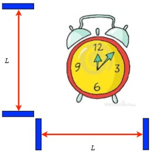
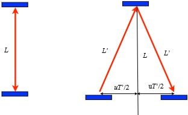
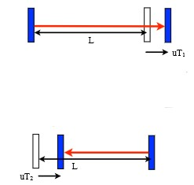

# Relativity

**Speed of light is _INDEPENDENT_ of the motion of the source**

## Coordinate System

Let 
- $S$ be a frame with origin $O$ for coordinate $x$ and time $t$
- $S'$ be a frame with origin $O'$ for coordinate $x'$ and time $t'$
- $S'$ is moving with velocity $u$ with respect to $S$ in $x$ direction as what $S$ **sees**
- Assume $O = O'$ at $t = t' = 0$

### Galilean Transformation

Conventionally, we are used to 
$$
x' = x - ut \space\space\space\space\space t' = t
$$
where $u$ is the velocity of $S'$ with respect to $S$

This is called **Galilean Transformation**. It is valid for low speeds. But it is not valid for high speeds since it violates the **speed of light** principle. This equation would state that speed of light is frame-dependent.

### Lorentz Transformation

#### A guess on the new time transformation
Now try a time transformation that depends on position and velocity
$$
x' = x - ut \\
t' = t - ux/c^2
$$

Now derive it by creating a light pulse in $S$ at $t_1=x_1=0$ and absorbed at $t_2=T, x_2=cT$
$$
x_1' = 0 \space\space\space\space\space x_2' = x_2 - ut_2 = cT - uT = (c - u)T \\
t_1' = 0 \space\space\space\space\space t_2' = t_2 - ux_2/c^2 = T - u(cT)/c^2 = (1 - u/c)T
$$

Now find the velocity of light in $S'$
$$
V' = \frac{x_2' - x_1'}{t_2' - t_1'} = \frac{(c - u)T}{(1 - u/c)T} = \frac{c - u}{1 - u/c} = c
$$

Now the transformation keeps the speed of light constant.

Actually this property should hold for all kind of function of velocity as long as the **same** function appears for both of them:
$$
x' = (x - ut) \cdot f(u) \\
t' = (t - ux/c^2) \cdot f(u)
$$
Of course we need $f(u = 0) = 1$ so that the transformation does nothing when $u = 0$

#### Light Clock experiment

Consider 3 identical clock that ticks at the same rate by mesuring the times it takes for light to travel between two mirrors with a distance $L$ between.

An observer who holds one clock would observe another moving clock to tick slower. 

The period of transverse clock can be calculated as follows: 

$$
L' = \sqrt(L^2 + (uT')^2) \\
T' = 2L'/c  \implies L' = cT'/2 \\
\frac{cT'}{2} = \sqrt(L^2 + (uT')^2) \\
\frac{c^2T'^2}{4} = L^2 + \frac{u^2T'^2}{4} \\
\frac{(c^2 - u^2)T'^2}{4} = L^2 \\
T' = \frac{4L}{\sqrt(c^2 - u^2)} = \frac{2L}{\sqrt(c^2 - u^2)} = \frac{2L}{c}\frac{1}{\sqrt(1 - u^2/c^2)}
$$

Thus the time intervals are different in the $S'$ frame by the factor of $\frac{1}{\sqrt(1 - u^2/c^2)}$

We put the factor as $f(u)$ in the guess of transformation.

$$
x' = \frac{x - ut}{\sqrt(1 - u^2/c^2)} \\
t' = \frac{t - ux/c^2}{\sqrt(1 - u^2/c^2)}
$$

#### Longitudinal Clock

Now suppose that the mirror is moving in the same direction as the light. 

In the forward direction, $cT_1 = L + uT_1$ and in the backward direction, $cT_2 = L - uT_2$. Sum up the total period:
$$
T_1 + T_2 = \frac{L}{c-u} + \frac{L}{c+u} = \frac{2Lc}{c^2 - u^2} = \frac{2L}{c}\frac{1}{(1 - u^2/c^2)}
$$

Note that the additional factor is missing the square root which made a difference. **BUT** the clocks must tick at the same rate!

The resolution is that **moving objects appear shorter** by a factor that makes the horizontal light clock tick at the same rate as the vertical clock. 

##### Length Contraction
Now find the distance in both $S$ and $S'$ frames. Let $\triangle x = x_2 - x_1, \triangle x' = x_2' - x_1'$. But consider $t=0$, we know $x_1' = x_1 = 0$ and $x_2' = \frac{x_2 - ut}{\sqrt(1 - u^2/c^2)}. 

Thus we get 
$$ 
\triangle x' = \frac{\triangle x}{\sqrt(1 - u^2/c^2)}\\
\triangle x = \triangle x' \sqrt(1 - u^2/c^2)
$$

Thus the length of an object in motion is contracted by a factor of $\sqrt(1 - u^2/c^2)$. Now reconsider the longitudinal clock:

$$
T_1 + T_2 = \frac{2\triangle x}{c} / \sqrt(1 - u^2/c^2) = \frac{2\triangle x'}{c} / \sqrt(1 - u^2/c^2)
$$

Note that $\triangle x'$ is the **stationary length of the clock in $S'$ frame**. So the above equation is the same as we got for the moving vertical light clocks. 

### Lorentz Contraction and Time Dilation

It is convenient to define $\beta = u/c$ and $\gamma = 1/\sqrt(1 - \beta^2)$. 

Lorentz Contraction: Moving objects appear shorter by a factor of $\gamma$, $L_{\text{moving}} = L_{\text{stationary}}/\gamma$

Time Dilation: Moving clocks tick slower by a factor of $\gamma$, $T_{\text{moving}} = \gamma \cdot T_{\text{stationary}} \iff f_{\text{moving}} = {f_{\text{stationary}}}/{\gamma}$

Then simplified equations are:
$$
x' = \gamma(x-\beta ct) \\
ct' = \gamma(ct - \beta x)
$$

#### Transverse Transformation

Now consider y-axis problems: 
- Frame $S'$ has velocity $u$ in x-axis as seen from $S$, where $t = t' = 0$
- A light pulse is emitted at $x_1 = y_1 = t_1 = x_1' = y_1' = t_1' = 0$
- The light pulse is absorbed at $x_2 = 0, y_2 = cT, t_2 = T$ in $S$ frame

We know how to find $x_2'$ and $t_2'$:
$$
x_2' = \gamma(x_2 - \beta ct_2) = \gamma(-\beta cT) = -\beta c\gamma T \\
ct_2' = \gamma(ct_2 - \beta x_2) = \gamma(-\beta cT) = -\beta c\gamma T
$$

In the $S'$ frame, the light is still a constant, thus we can do:
$$
\begin{align*}
\frac{\triangle s}{\triangle t} &= c \\
\frac{\sqrt(x_2' - x_1')^2 + (y_2' - y_1')^2}{t_2' - t_1'} &= c \\
(\beta c\gamma T)^2 + (y_2')^2 &= (\gamma cT)^2 \\
(y_2')^2 &= (\gamma^2 - \beta^2\gamma^2) (cT)^2 
\end{align*}
$$ 

Note that if we expand it, $\gamma^2 - \beta^2\gamma^2 = \gamma^2(1 - \beta^2) = (\frac{1}{\sqrt(1 - \beta^2)})^2(1 - \beta^2) = 1$. Thus $y_2' =cT = y_2$.

In other words, **transverse length is not contracted**.

### Relativistic Addition of Velocities

Assume A and B are traveling in opposite directions with $\beta = \frac{2}{3}$ and $\beta = -\frac{2}{3}$ respectively. Then what is the relative velocity of A and B?

#### derivation

Let an object is moving with velocity $v'$ as measured from $S'$ and $u$ as measured from $S$.

In the $S'$ frame, at time $t'$, it will be at $x' = v't'$. In the $S$ frame, it corresponds to $x = \gamma(v't' + \beta ct') = \gamma(v' + \beta c)t' = \gamma(v' + u)t'$. $ct = \gamma(ct' + \beta x') = \gamma(1 + \frac{uv'}{c^2})ct'$.

Then the velocity in the S frame is:
$$
V = \frac{x}{t} = \frac{\gamma(v' + u)t'}{\gamma(1 + \frac{uv'}{c^2})ct'} = \frac{v' + u}{1 + \frac{uv'}{c^2}}
$$

Rewrite it as $\beta_{1+2} = \frac{\beta_1 + \beta_2}{1 + \beta_1\beta_2}$

Note that if $v' = c$, then $V = \frac{c + u}{1 + \frac{uc}{c^2}} = c$. Thus the speed of light is still constant. Something moving at the speed of light in one frame will also move at the speed of light in another frame.

### Classical Doppler Effect