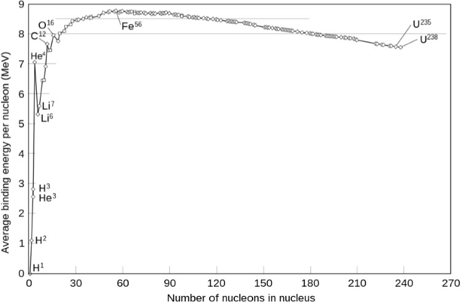

# Atoms

## Measuring Light Wavelengths

If light goes through small slits, it emerges in circular waves.

If the slit spacing is $d$, the path-length difference between slits is $\triangle x = d \sin \theta$.

If the wavelength is $\lambda$, the waves will be **in phase** if $\triangle x = n \lambda, \forall n \in \mathbb{Z}$.

Note that it is different from *Bragg diffraction*, the $\theta$ here is measured from the **normal**, not the surface.

### Diffraction Facts

$$
d \sin \theta = n \lambda \implies \sin \theta = n\frac{ \lambda}{d}
$$

- If $d>>\lambda$, $\sin \theta \approx \theta$ since the angle is small thus diffraction is invisible.
- If $\lambda > d$, $\sin \theta > 1$ and no diffraction occurs.

## Spectral Emission Lines

Hot dense objects emit black-body radiation, which is a continuous spectrum that only depends on temperature and not the material/substance.

However, for low density gases in electrical discharge tubes,they emit at only a few discrete wavelengths. This is called **line emission**.

Interestingly, the gases can absorb the same wavelengths they emit. This is called **line absorption**.

### Absorption and Emission Bands

Absorption and emission are due to *vibrations of electrons* in the atoms. Electrons have low mass, thus the $\omega = \sqrt{\frac{k}{m}}$ is high, and the energy levels are quantized.

Cooler atoms form molecules. The atoms in molecules can also vibrate. With the much larger mass, the vibrational frequency is much lower.

Molecules can also rotate. It turns out to give absorption lines that are so close together that they look continuous and they are called **absorption bands**.

### Balmer Series

John Balmer found that the wavelengths of the hydrogen emission lines are given by

$$
\lambda = B \frac{n^2}{n^2 - 2^2}
$$

where $B = 364.50682 \text{ nm}$ and $n\in \mathbb{N}, n > 2$.

Later, they find that the formula needs to be modified to fit in ultraviolet and infrared regions. It works for only visible light for now.

For $B=364.50682 \text{ nm}, n>m$:

$$
\begin{align*}
\lambda &= \frac{B}{4}\frac{n^2m^2}{n^2 - m^2} \\
m &=1 : \text{Lyman series for ultraviolet} \\
m &=2 : \text{Balmer series for visible} \\
m &=3 : \text{Paschen series for infrared}
\end{align*}
$$

### Rydberg Formula
Let $n,m$ be two orbit numbers. The Rydberg formula is

$$
\frac{1}{\lambda} = R Z^2 \left( \frac{1}{n^2} - \frac{1}{m^2} \right)
$$

where $R = 1.097373 \times 10^{-7} \text{ m}^{-1} = \frac{1}{91.13 \text{nm}}$ and $Z$ is the atomic number (nuclear charge).

Using Planck's formula $E = \frac{hc}{\lambda}$, we can find the energy levels of the atom.

$$
E = \frac{hc}{\lambda} = hc R Z^2 \left( \frac{1}{n^2} - \frac{1}{m^2} \right) = 13.598 \text{ eV} \cdot {Z^2} \left( \frac{1}{n^2} - \frac{1}{m^2} \right)
$$

## Electron Charge to Mass Ratio

Magnetic fields can deflect charged particles. The force on a charged particle is $F = qvB \sin \theta$.

At the same time, we can set up electric fields to balance the magnetic force. The electric force is $F = qE$.

If we set them perpendicular to each other: $F_{\text{electric}} = F_{\text{magnetic}} \implies qE = qvB \implies \frac{E}{B} = v$.

Now determine the charge-to-mass ratio of electrons:

$$
\text{Energy }U = qV = \frac{1}{2}mv^2 = \frac{1}{2}m\left( \frac{E}{B} \right)^2 \implies \frac{q}{m} = \frac{1}{2V} \left( \frac{E}{B} \right)^2
$$

## Bohr Model

Bohr postulated that the **angular momentum** of the orbits could only be **integer multiples of Planck's constant h**, but divided by $2\pi$. Define $\frac{h}{2\pi} = \hbar$.

Angular momentum is $\vec{L} = \vec{r} \times \vec{p} \implies L = mvr = n\hbar$.

- Energy $E = -13.6 \text{ eV} \frac{Z^2}{n^2}$. The spectral line energies are differences of Bohr orbit energies.
- Radius $r = \frac{4\pi \epsilon_0 }{q^2} \frac{\hbar^2}{m} \frac{n^2}{Z}$ where the constant $\frac{4\pi \epsilon_0 }{q^2} \frac{\hbar^2}{m}$ is 52.97 pm. Thus $r = 52.97 \text{ pm} \frac{n^2}{Z}$.
- Velocity $v=\frac{Z}{n} \frac{q^2}{4\pi \epsilon_0 \hbar} \implies \beta = \frac{v}{c} = \frac{Z}{n} \frac{q^2}{4\pi \epsilon_0 \hbar c}$ where the constant $\frac{q^2}{4\pi \epsilon_0 \hbar c}$ is $7.293 \times 10^{-3}$. Note that for large $Z$, $\beta$ is close to 1 which the relativistic effects are important.

### Reduced Mass

In reality, the electron and the proton both orbit around the centre of mass of the system.

- Hydrogen atom: $\mu = \frac{m_e m_p}{m_e + m_p} \approx m_e$ since $m_p >> m_e$.

## X-Ray Emission

As the atomic number $Z$ goes up, the Rydberg wavelengths go into UV and eventually the X-ray region. However, it gets increasingly difficult to get rid of the electrons while leaving exactly one.

Moseley found that the square root of the frequency of the K-line is linearly related to the atomic number $Z$. State the relationship as $\sqrt{f} = a(Z-b)$.

### Mosley's Law
For $K_{\alpha}$ X-ray line:

$$
E = 10.2 \text{ eV} (Z-1)^2
$$

If we compare it to the Rydberg formula $E = 13.6 \text{ eV} Z^2 (\frac{1}{n_1^2} - \frac{1}{n_2^2})$, we see that $(\frac{1}{n_1^2} - \frac{1}{n_2^2}) = \frac{10.2}{13.6} \approx 0.75$, which implies that $n_1 = 1$ and $n_2 = 2$.

The above is an indication that $K_{\alpha}$ X-ray line is due to the transition from $n=2$ to $n=1$. An electron in the second Bohr orbit falls to the first orbit.

#### $K_{\beta}$ X-ray Line

The $K_{\beta}$ X-ray line is due to the transition from $n=3$ to $n=1$. An electron in the third Bohr orbit falls to the first orbit.

$$ 
E = 13.6 \text{ eV} (Z-1)^2 \left( \frac{1}{1^2} - \frac{1}{3^2} \right) = 13.6 \text{ eV} (Z-1)^2 \left( \frac{8}{9} \right) = 12.09 \text{ eV} (Z-1)^2
$$

#### $L_{\alpha}$ X-ray Line

The $L_{\alpha}$ X-ray line is due to the transition from $n=3$ to $n=2$. An electron in the third Bohr orbit falls to the second orbit.

$$
E = 13.6 \text{ eV} (Z-7.4)^2 \left( \frac{1}{2^2} - \frac{1}{3^2} \right) = 13.6 \text{ eV} (Z-7.4)^2 \left( \frac{5}{36} \right) = 1.889 \text{ eV} (Z-7.4)^2
$$

There are 2 electrons in a full $n=1$ shell and 8 electrons in a full $n=2$ shell. 

### More X-Ray Line Notations

From each level, there are multiple ways to fall to the lower levels. The notation is as follows:
- $K_{\alpha}$: $n=2 \to n=1$, $K_{\beta}$: $n=3 \to n=1$, $K_{\gamma}$: $n=4 \to n=1$ etc. 
- $L_{\alpha}$: $n=3 \to n=2$, $L_{\beta}$: $n=4 \to n=2$, $L_{\gamma}$: $n=5 \to n=2$ etc.
- $M_{\alpha}$: $n=4 \to n=3$, $M_{\beta}$: $n=5 \to n=3$ etc.
- More keeps going on.

## Franck-Hertz Experiment

The Franck-Hertz experiment is a demonstration of the quantization of energy levels in atoms. The experiment was first conducted by James Franck and Gustav Hertz in 1914. 

It was the first clear evidence that the same discrete atomic energy levels, correlated with photon wavelengths via Planck's constant, also showed up in the interactions of electrons with atoms. 

## de Broglie Wavelength

de Broglie proposed that particles can have wave-like properties. The wavelength of a particle is $\lambda = \frac{h}{p} = \frac{h}{mv}$.
- Angular momentum $L=rp$
- $\lambda = \frac{hr}{L}$
- To go around a circle with the same path, the wavelength must be an integer multiple of the circumference: $2\pi r = n\lambda \implies L =n\frac{h}{2\pi} = n\hbar$.

A uniform and constant current following a circular path makes a magnetic field, but it **does not** radiate energy. This is because the magnetic field is perpendicular to the velocity even if the charges are accelerating. 

In Schrodinger quantum mechanics, the wave is complex with the real and imaginary parts out of phase by $90^\circ$, so the probability of finding the electron at any place along the orbit is constant.

### Wave Energy
- For photons: $p = \frac{E}{c} \land \lambda = \frac{h}{p} \implies \frac{hc}{E}$
- For **non-relativistic** matter, the relation between kinetic energy and momentum is $E=\frac{1}{2}mv^2 = \frac{1}{2}\frac{(mv)^2}{m}= \frac{p^2}{2m} \implies \lambda = \frac{h}{p} = \frac{h}{\sqrt{2mE}} = \frac{hc}{\sqrt{2mc^2E}}$. 

## Electron orbits

- Moseley's Law $E_{K_{\alpha}} = 13.6 \text{ eV} (\frac{1}{1^2} - \frac{1}{2^2}) (Z-1)^2$ implies that one electron in the second orbit falls to the first orbit while one electron in the first orbit is removed. The $Z-1$ term implies that one electron remains in the first orbit. So there were 2 electrons in the $n=1$ orbit
- $E_{L_{\alpha}} = 13.6 \text{ eV} (\frac{1}{2^2} - \frac{1}{3^2}) (Z-7.4)^2$ implies that one electron in the third orbit falls to the second orbit while one electron in the second orbit is removed. The $Z-7.4$ term implies that about 7.4 electrons are "screening" the $n=3$ electrons from the nucleus.
- All the above suggests that there are other rules governing the phenomenon. 

### Pauli Exclusion Principle

- There can be only two electrons in a given "state" (quantum numbers) and they must have opposite spins.
- The wave function for identical particles 1 and 2 is $\Psi(\vec{x}_1, s_1, \vec{x}_2, s_2)$. 

### Angular Momentum States

- Bohr model and Schrodinger all states $L = n\hbar$. But Schrodinger allows $n=0$ and $l=0$.
- For $l=0$ state, it is high energy and unstable. It is called the **s-state**. Pauli exclusion principle allows 2 electrons in the same state with opposite spins.
- For $l=1$ state, it is called the **p-state**. It has 3 orientations $m_l = -1, 0, 1$. The $m_l=0$ is the most stable. Pauli exclusion principle allows 6 electrons in the same state with opposite spin pairs in each orientation.
- For $l=2$ state, it is called the **d-state**. It has 5 orientations $m_l = -2, -1, 0, 1, 2$. The $m_l=0$ is the most stable. Pauli exclusion principle allows 10 electrons in the same state with opposite spin pairs in each orientation.
- For $l=3$ state, it is called the **f-state**. It has 7 orientations $m_l = -3, -2, -1, 0, 1, 2, 3$. The $m_l=0$ is the most stable. Pauli exclusion principle allows 14 electrons in the same state with opposite spin pairs in each orientation.

## Neutrons

Neutron mass was slightly larger than the mas of a proton plus an electron. It implies that neutron can decay into a proton, an electron, and an anti-neutrino. The anti-neutrino is a massless particle with no charge and no interaction with matter.

$$
n^0 \to p^+ + e^- + \bar{\nu}^0_e + 0.783 \text{ MeV}
$$

### Nuclear Binding Energy

For most elements, the binding energy per nucleon is about 8 MeV. The binding energy per nucleon is the energy required to remove a nucleon from the nucleus. Compared to the few eV per atom in chemical bonds, the nuclear binding energy is much larger.

#### Neutron-Proton Interaction

- In Deuterium $H^2$, the neutron and proton are bound together. The binding energy is a bit more than $1 \text{ MeV}$. There is only 1 pair of interactions in the nucleus.
- In both Tritium $H^3$ and Helium $He^3$, there are 3 pairs of interactions in the nucleus. The binding energy is almost $3 \text{ MeV}$.
- In Helium $He^4$, there are 6 pairs of interactions in the nucleus. The binding energy is about $7 \text{ MeV}$.

The increase in binding per nucleon is due to the increase in the number of interactions in the nucleus. But it seems to saturate at about 8 MeV per nucleon.

From that we expect that Protons and Neutrons attract both Neutrons and Protons equally. The attraction depends on the relative "spin" (both $\pm \frac{1}{2}$) of the particles. The attraction is only strong enough to bind them if the spins are aligned. If the spins are anti-aligned, it is not strong enough. 

However, the Pauli exclusion principle prevents the spins of two Protons or two Neutrons from being aligned. But one Proton and one Neutron can have aligned spins. This is why the Deuterium nucleus is stable. It has total spin 1.

### Neutron Decay

Free Neutrons decay with a 1/e lifetime of about 15 minutes or half-life of about 10 minutes. But it does not decay in nuclei.

- In big nuclei, Pauli exclusion requires most Protons and Neutrons to be in high-energy states. 
- If a Neutron decays, it turns into a Proton. Pauli prevents the Proton from goint in to a low-energy state, because those states are occupied by other Protons.
- The Proton usually has to go into an empty state with higher energy. If that extra energy is larger than the Neutron-Proton mass difference, the Neutron cannot decay. 
- If there are too many Neutrons, then the Neutron can decay until the number of Neutrons and Protons is close to equal.

#### Proton to Neutron Decay

Same idea as Neutrons:
- If there are too many Protons in a nucleus, some Protons must be in the high-energy states. And there are empty Neutron states with lower energy.
- A proton can emit an anti-electron (positron) and a neutrino and turn into a neutron. 
- Since Proton mass is slightly smaller than Neutron mass, the Proton decay would not happen in free space. Only in a proton-rich nucleus.

## Fusion, Decay and Fission

Saturation implies that the nuclear force is basically "nearest neighbor". The force is short-range and attractive. The force is repulsive at very short distances.

- The steep positive slope on the left is due to strong attraction between protons and neutrons. **Fusing** them together releases energy. (Stars and Hydrogen bombs)
- The negative slope beyond Iron is due to the Coulomb repulsion between protons. **Fission** which breaks a big nucleus up into smaller pieces releases energy. (Nuclear reactors and atomic bombs)    

### Alpha Decay

Ejecting 2 protons and 2 neutrons bound into a Helium nucleus. The energy is a net energy gain by reducing the proton repulsion. 

Reduce the atomic number by 2 and the mass number by 4. The energy released is about 4 MeV.

### Beta Decay

Alpha decay usually leads to more Neutrons than needed. A neutron typically decays into an Proton, Electron and Anti-neutrino.

The energy released is about 1 MeV. The atomic number increases by 1 and the mass number stays the same. This may allow a subsequent alpha decay or there may be a second beta decay making another Alpha decay more likely.

### Gamma Decay

After Alpha or Beta decay, the nucleus may be left in an excited state. It can emit a high-energy photon to go to a lower energy state. The energy is typically a few MeV. Much like photon emission in atoms.

### Fission

Any nucleus can capture either a Proton or a Neutron and become a heavier nucleus. Proton is harder to capture because of the Coulomb repulsion. Neutron capture is more common.

Electrostatic repulsion of protons makes large nuclei unstable. Hitting a large nucleus with an energetic Neutron can cause it to split into two smaller nuclei. The energy released is about 200 MeV. It also releases 2 or 3 more Neutrons which can cause more fission as a chain reaction.

#### Uranium Fission

U-238 is not fissionable by thermal neutrons. The energy produced is not enough to cause fission. Natural Uranium is mostly U-238.

Uranium-235 is the most common isotope used in nuclear reactors. It is fissionable by thermal neutrons. The fission products are usually Barium and Krypton. The energy released is about 200 MeV.

On average, a Neutron from a fission travels a few centimeters before causing another fission. So you need a lump of U-235 that is more than a few centimeters in radius to sustain a chain reaction. **Critical mass** is the minimum mass needed to sustain a chain reaction.

But you need to assemble the critical mass only when you are at the target.
- if the Neutrons are slowed down, U-238 absorbs fewer Neutrons and the chain reaction is more efficient. So it is possible even with a fair amount of U-238 mixed in.
- The hydrogen in water slows down the Neutrons. So water is used as a moderator in most reactors.
- A standard water-cooled power reactor can operate for about 18 months before the fuel needs to be replaced. The fuel is about 3% U-235 and 97% U-238.
- Heavy water (deuterium oxide) is a better moderator than light water because it absorbs fewer Neutrons. A CANDU reactor with heavy water can operate with natural Uranium.

#### Plutonium Fission

When U-238 absorbs a Neutron, it becomes U-239. It has too many Neutrons so one decays into a Proton make Neptunium-239. The Neptunium-239 still has too many Neutrons so one decays into a Proton to make Plutonium-239. Plutonium-239 is fissionable by thermal Neutrons with better efficiency than U-235.

U-239 can also capture a second neutron and you end up with some Pu-240. Pu-240 has a high rate of **spontaneous fission**. So it is not good for making bombs. But it is good for making reactors.

### Fusion

Two Protons can collide and fuse into Deuterium while simultaneously emitting an anti-Electron and a Neutrino. It is very uncommon otherwise stars would not be able to burn for billions of years.

When a Proton hits the Deuterium, it can form Helium-3. It releases about 6MeV as energy in Gamma-ray form. 

When two Helium-3 nuclei collide, they can fuse into Helium-4 and 2 protons. It releases about 12 MeV as energy in Gamma-ray form.

#### Hydrogen Bomb

Since the proton proton to Deuterium reaction is so slow, hytrogen bombs use a different reaction. 

Deuterium (H-2) and Tritium (H-3) are fused into Helium-4 and a Neutron with about 14 MeV. H-2 exists in natural water. H-3 is radioactive, thus not found naturally and can be made from Lithium-6.

The Lithium-6 reaction requires high temperatures and pressures. So usually a fission bomb is used to start the fusion reaction. The fission bomb is surrounded by Deuterium and Tritium. The fission bomb releases a lot of Neutrons which start the fusion reaction.