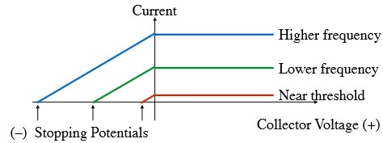
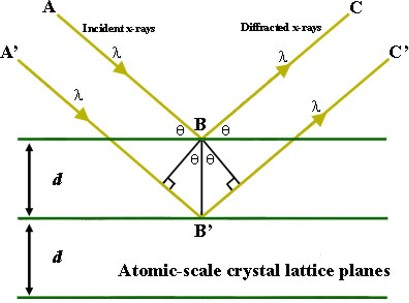
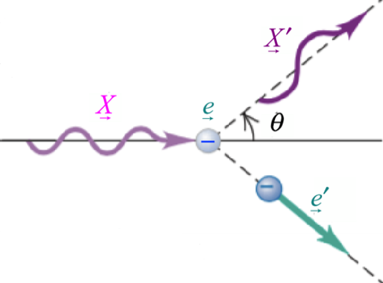

# Photons

Electromagnetic waves, in fact, can only have certain **discrete/quntized** amplitudes. 
- Photons have energy $E = hf$, where $h$ is Planck's constant and $f$ is the frequency of the wave.
- Photons also have momentum satisfying $E = pc$ since $E^2 = p^2c^2 + m^2c^4$ and $m = 0$ for photons. Thus $p = \frac{E}{c} = \frac{hf}{c}$.

## Blackbody Radiation

### Rayleigh-Jeans Law

$$
\begin{align*}
dI_{RJ}(f) = \frac{2f^2}{c^2}kTdf \\
dI_{RJ}(\lambda) = \frac{2 c}{\lambda^4}kT d\lambda
\end{align*}
$$

### Planck's Law

$$
\begin{align*}
dI(f) = \frac{2 hf^3}{c^3}\frac{1}{e^{\frac{hf}{kT}}-1}df \\
dI(\lambda) = \frac{2 hc^2}{\lambda^5}\frac{1}{e^{\frac{hc}{\lambda kT}}-1}d\lambda
\end{align*}
$$

### Quantization of Energy

Boltzmann factor: $e^{-\frac{E}{kT}}$ where $E = hf$.

- At low frequencies, $hf << kT$, thus the energy steps are very small. Then it can be treated as a continuous spectrum.
- At high frequencies, $hf >> kT$, thus the energy steps are very large. Then it can be treated as a discrete spectrum.

However, the energy depends not only on the wave amplitude but also on the dimensions of the box. 

## Photoelectric Effect

- The photoelectric effect is the emission of electrons from a material when light of a certain frequency shines on it.
- Current emitted is proportional to the intensity of the light.
- Positive voltage increase the current to a **saturation current** (plateau).
- Negative voltage which repels the electrons decreases the current. If the voltage is too high, the current will be zero (Stopping potential).

### Einstein's Explanation

Einstein thinks that the stopping potential implies that there was a ejected electron kinetic energy: $E_{\text{max}}=qV_{\text{stop}}$. The dependence of the stopping potential on the frequency of the light implies that the energy of the ejected electron is increased with the frequency of the light. Then he guessed with Planck's work $E = hf$ that:
$$
qV_{\text{stop}} = hf - q\phi_{\text{work}}
$$
where $\phi$ is the work function of the material. The threshold frequency is given by: $hf_{\text{threshold}} = q\phi_{\text{work}}$. The work function is a property of the material in units of volts.

## X-Rays

### Diffraction and Bragg's Law

If the plane spacing is $d$, the angle of incidence is $\theta$, and the wavelength of the X-ray is $\lambda$. If it is in phase, then the path difference between the two rays is $2d\sin\theta = n\lambda$. This is Bragg's Law.

### X-Ray Spectrum

For a given voltage, there is a minimum X-ray wavelength, which corresponds to the maximum frequency.

$$
qV = hf_{\text{max}} = \frac{hc}{\lambda_{\text{min}}}
$$

Note that it is the Photoelectric Effect equation without the work function. Technically, the work function "sucks" the cathode ray electron into the anode, so the energy is $q(V+\phi_{\text{work}}) = hf_{\text{max}}$. However, the work function is usually a few Volts while X-ray voltages are in the thousands of Volts. Thus, the work function is negligible.

## Photon Momentum-Wavelength Relation

- Relativity: All particles obey $E^2 = (pc)^2 + (mc^2)^2$. Photons have no mass, so $E = pc$.
- Quantum Mechanics: Photons obey $E = hf = \frac{hc}{\lambda}$.
- Combining the two: $p = \frac{hf}{c} = \frac{h}{\lambda}$.

### Compton's Equation

Incident X-ray $\vec{X} = (\frac{pc}{c}, \vec{p})$, scattered X-ray $\vec{X'} = (\frac{p'c}{c}, \vec{p'})$, and inital electron at rest: $\vec{e} = (mc^2, \vec{0})$ and final electron $\vec{e'}$. The equation states:

$$ 
\lambda' - \lambda = \frac{h}{m_e c}(1 - \cos\theta)
$$

where $\lambda$ is the wavelength of the incident X-ray, $\lambda'$ is the wavelength of the scattered X-ray, and $\theta$ is the angle between the incident and scattered X-ray.

### 波粒二象性

- X-ray photons scatter as if they are particles with momentum as well as energy.
- Bragg spectrometer: X-rays are diffracted by a crystal lattice as if they are waves.
- In the quantum wave model, the amplitude is quantized such that $E = nhf$. Since $h$ is quite small, the quantization is only noticeable at extremely high frequencies. Thus in the classical wave model, the amplitude is continuous.

## Photon Flux and Density

- Flux: Number of photons per unit area per unit time.
- Density: Number of photons per unit volume.

### Flux

An EM wave has power flux in $\frac{W}{m^2} = \frac{J}{m^2s}$, which is the energy flux per unit area, basically power per area. The energy of a photon is $E = hf$, so the number of photons per unit area per unit time is $\frac{P}{hf}$.

### Density

Flux is density times velocity, thus the density is flux divided by velocity. The velocity of a photon is $c$, so the density is $\frac{P}{hfc}$.