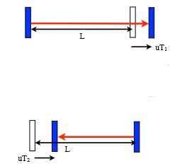

# Relativity

**Speed of light is _INDEPENDENT_ of the motion of the source**

## Coordinate System

Let 
- $S$ be a frame with origin $O$ for coordinate $x$ and time $t$
- $S'$ be a frame with origin $O'$ for coordinate $x'$ and time $t'$
- $S'$ is moving with velocity $u$ with respect to $S$ in $x$ direction as what $S$ **sees**
- Assume $O = O'$ at $t = t' = 0$

### Galilean Transformation

Conventionally, we are used to 
$$
x' = x - ut \space\space\space\space\space t' = t
$$
where $u$ is the velocity of $S'$ with respect to $S$

This is called **Galilean Transformation**. It is valid for low speeds. But, it is not valid for high speeds since it violates the **speed of light** principle. This equation would state that the speed of light is frame-dependent.

### Lorentz Transformation

#### A guess on the new time transformation
Now try a time transformation that depends on position and velocity
$$
x' = x - ut \\
t' = t - ux/c^2
$$

Now derive it by creating a light pulse in $S$ at $t_1=x_1=0$ and absorbed at $t_2=T, x_2=cT$
$$
x_1' = 0 \space\space\space\space\space x_2' = x_2 - ut_2 = cT - uT = (c - u)T \\
t_1' = 0 \space\space\space\space\space t_2' = t_2 - ux_2/c^2 = T - u(cT)/c^2 = (1 - u/c)T
$$

Now find the velocity of light in $S'$
$$
V' = \frac{x_2' - x_1'}{t_2' - t_1'} = \frac{(c - u)T}{(1 - u/c)T} = \frac{c - u}{1 - u/c} = c
$$

Now the transformation keeps the speed of light constant.

Actually, this property should hold for all kinds of functions of velocity as long as the **same** function appears for both of them:
$$
x' = (x - ut) \cdot f(u) \\
t' = (t - ux/c^2) \cdot f(u)
$$
Of course, we need $f(u = 0) = 1$ so that the transformation does nothing when $u = 0$

#### Light Clock experiment

Consider 3 identical clocks that tick at the same rate by measuring the times it takes for light to travel between two mirrors with a distance $L$ between.

An observer who holds one clock would observe another moving clock to tick slower. 

The period of a transverse clock can be calculated as follows: 

$$
L' = \sqrt(L^2 + (uT')^2) \\
T' = 2L'/c  \implies L' = cT'/2 \\
\frac{cT'}{2} = \sqrt(L^2 + (uT')^2) \\
\frac{c^2T'^2}{4} = L^2 + \frac{u^2T'^2}{4} \\
\frac{(c^2 - u^2)T'^2}{4} = L^2 \\
T' = \frac{4L}{\sqrt(c^2 - u^2)} = \frac{2L}{\sqrt(c^2 - u^2)} = \frac{2L}{c}\frac{1}{\sqrt(1 - u^2/c^2)}
$$

Thus the time intervals are different in the $S'$ frame by the factor of $\frac{1}{\sqrt(1 - u^2/c^2)}$

We put the factor as $f(u)$ in the guess of transformation.

$$
x' = \frac{x - ut}{\sqrt(1 - u^2/c^2)} \\
t' = \frac{t - ux/c^2}{\sqrt(1 - u^2/c^2)}
$$

#### Longitudinal Clock

Now suppose that the mirror is moving in the same direction as the light. 

In the forward direction, $cT_1 = L + uT_1$ and in the backward direction, $cT_2 = L - uT_2$. Sum up the total period:
$$
T_1 + T_2 = \frac{L}{c-u} + \frac{L}{c+u} = \frac{2Lc}{c^2 - u^2} = \frac{2L}{c}\frac{1}{(1 - u^2/c^2)}
$$

Note that the additional factor is missing the square root which made a difference. **BUT** the clocks must tick at the same rate!

The resolution is that **moving objects appear shorter** by a factor that makes the horizontal light clock tick at the same rate as the vertical clock. 

##### Length Contraction
Now find the distance in both $S$ and $S'$ frames. Let $\triangle x = x_2 - x_1, \triangle x' = x_2' - x_1'$. But consider $t=0$, we know $x_1' = x_1 = 0$ and $x_2' = \frac{x_2 - ut}{\sqrt(1 - u^2/c^2)}$. 

Thus we get 
$$ 
\triangle x' = \frac{\triangle x}{\sqrt(1 - u^2/c^2)}\\
\triangle x = \triangle x' \sqrt(1 - u^2/c^2)
$$

Thus the length of an object in motion is contracted by a factor of $\sqrt(1 - u^2/c^2)$. Now reconsider the longitudinal clock:

$$
T_1 + T_2 = \frac{2\triangle x}{c} / \sqrt(1 - u^2/c^2) = \frac{2\triangle x'}{c} / \sqrt(1 - u^2/c^2)
$$

Note that $\triangle x'$ is the **stationary length of the clock in $S'$ frame**. So the above equation is the same as we got for the moving vertical light clocks. 

### Lorentz Contraction and Time Dilation

It is convenient to define $\beta = u/c$ and $\gamma = 1/\sqrt(1 - \beta^2)$. 

Lorentz Contraction: Moving objects appear shorter by a factor of $\gamma$, $L_{\text{moving}} = L_{\text{stationary}}/\gamma$

Time Dilation: Moving clocks tick slower by a factor of $\gamma$, $T_{\text{moving}} = \gamma \cdot T_{\text{stationary}} \iff f_{\text{moving}} = {f_{\text{stationary}}}/{\gamma}$

Then simplified equations are:
$$
x' = \gamma(x-\beta ct) \\
ct' = \gamma(ct - \beta x)
$$

#### Transverse Transformation

Now consider y-axis problems: 
- Frame $S'$ has velocity $u$ in x-axis as seen from $S$, where $t = t' = 0$
- A light pulse is emitted at $x_1 = y_1 = t_1 = x_1' = y_1' = t_1' = 0$
- The light pulse is absorbed at $x_2 = 0, y_2 = cT, t_2 = T$ in $S$ frame

We know how to find $x_2'$ and $t_2'$:
$$
x_2' = \gamma(x_2 - \beta ct_2) = \gamma(-\beta cT) = -\beta c\gamma T \\
ct_2' = \gamma(ct_2 - \beta x_2) = \gamma(-\beta cT) = -\beta c\gamma T
$$

In the $S'$ frame, the light is still a constant, thus we can do:
$$
\begin{align*}
\frac{\triangle s}{\triangle t} &= c \\
\frac{\sqrt(x_2' - x_1')^2 + (y_2' - y_1')^2}{t_2' - t_1'} &= c \\
(\beta c\gamma T)^2 + (y_2')^2 &= (\gamma cT)^2 \\
(y_2')^2 &= (\gamma^2 - \beta^2\gamma^2) (cT)^2 
\end{align*}
$$ 

Note that if we expand it, $\gamma^2 - \beta^2\gamma^2 = \gamma^2(1 - \beta^2) = (\frac{1}{\sqrt(1 - \beta^2)})^2(1 - \beta^2) = 1$. Thus $y_2' =cT = y_2$.

In other words, **transverse length is not contracted**.

### Relativistic Addition of Velocities

Assume A and B are traveling in opposite directions with $\beta = \frac{2}{3}$ and $\beta = -\frac{2}{3}$ respectively. Then what is the relative velocity of A and B?

#### derivation

Let an object is moving with velocity $v'$ as measured from $S'$ and $u$ as measured from $S$.

In the $S'$ frame, at time $t'$, it will be at $x' = v't'$. In the $S$ frame, it corresponds to $x = \gamma(v't' + \beta ct') = \gamma(v' + \beta c)t' = \gamma(v' + u)t'$. $ct = \gamma(ct' + \beta x') = \gamma(1 + \frac{uv'}{c^2})ct'$.

Then the velocity in the S frame is:
$$
V = \frac{x}{t} = \frac{\gamma(v' + u)t'}{\gamma(1 + \frac{uv'}{c^2})ct'} = \frac{v' + u}{1 + \frac{uv'}{c^2}}
$$

Rewrite it as $\beta_{1+2} = \frac{\beta_1 + \beta_2}{1 + \beta_1\beta_2}$

Note that if $v' = c$, then $V = \frac{c + u}{1 + \frac{uc}{c^2}} = c$. Thus the speed of light is still constant. Something moving at the speed of light in one frame will also move at the speed of light in another frame.

### $\beta, \gamma$ approximation
- $|\beta| \in [0, 1]$, $\gamma \in [1, \infty)$
- $\beta = 0$ corresponds to rest, increasing $\beta$ corresponds to increasing speed
- $\gamma = 1$ corresponds to rest, increasing $\gamma$ corresponds to increasing speed
- For small $\beta$, Taylor expansion gives $\gamma \approx 1 + \frac{1}{2}\beta^2$. Inverting, $\beta \approx \sqrt{1-1/\gamma^2}$ 
- For large $\gamma$, $\beta \approx 1 - \frac{1}{2}\frac{1}{\gamma^2}$

## Doppler Effect

**motion of the source and observer affects the frequency of the wave.**

In the following sections, we will use positive velocity as a moving away from the observer as the convention.

### Classical Doppler Effect

In the classical Doppler effect, there is a difference between the frequency of the source and the observer.

#### Observer at rest

If source is moving away with a velocity $u$, the observer sees a wave period of $\triangle T_{\text{obs}} = \triangle T_{\text{source}}(1 + \frac{u}{c})$. Time itself plus the distance the source moves in that time.

Thus the frequency $f=\frac{1}{\triangle T}$ is $f_{\text{obs}} = f_{\text{source}}/(1 + \frac{u}{c})$

Since wavelength $\lambda = c\triangle T$, we have $\lambda_{\text{obs}} = \lambda_{\text{source}}(1 + \frac{u}{c})$

#### Source at rest

In this case:
$$
\begin{align*}
\triangle T_{\text{obs}} &= \triangle T_{\text{source}} + \frac{u\triangle T_{\text{obs}}}{c} \\
\triangle T_{\text{obs}} &= \frac{\triangle T_{\text{source}}}{1 - \frac{u}{c}} \\
f_{\text{obs}} &= f_{\text{source}}(1 - \frac{u}{c})
\end{align*}
$$

For $u<<c$, the two equations are the same. But when $u$ is comparable to $c$, the two equations are different.

#### Extreme cases

Consider sound waves instead of light waves. $u$ can be easily comparable to $c$ or even larger.

- $u\to -c \implies f_{\text{obs}} \to \infty$ since source arrives before the wave does

### Relativistic Doppler Effect

From the observer's point of view, the clock in a moving source ticks slower by a factor of $\gamma$. Find the period using the observer's clock:
$$
\triangle T_{\text{obs}} = \gamma \triangle T_{\text{source}} (1 + \frac{u}{c}) = \triangle T_{\text{source}} \sqrt(\frac{1 + u/c}{1 - u/c})
$$

Thus the frequency is $f_{\text{obs}} = f_{\text{source}}\sqrt(\frac{1 - u/c}{1 + u/c})$ and the wavelength is $\lambda_{\text{obs}} = \lambda_{\text{source}}\sqrt(\frac{1 + u/c}{1 - u/c})$

If we check it from the source at rest, observer moving case, we get the **same result**.

## 4-Vector Notation

It is convenient to consider $ct$ at the 0th component of what is called a **space-time coordinate 4-vector** along with $x,y,z=\vec{x}$.
$$
\vec{X} = (ct, \vec{x}) = (ct, x, y, z)
$$

### Lorentz Transformation in 4-vector notation
$$
\begin{bmatrix}
ct' \\
x' \\
y' \\
z'
\end{bmatrix}
=
\begin{bmatrix}
\gamma & -\beta\gamma & 0 & 0 \\
-\beta\gamma & \gamma & 0 & 0 \\
0 & 0 & 1 & 0 \\
0 & 0 & 0 & 1
\end{bmatrix}
\begin{bmatrix}
ct \\
x \\
y \\
z
\end{bmatrix}
=
\begin{bmatrix}
\gamma(ct - \beta x) \\
\gamma(x - \beta ct) \\
y \\
z
\end{bmatrix}
$$
Here $x$ is just the direction of motion. If need to transform into another coordinate system, then need to count the angle between the two systems.

### 4-vector dot product
Define the dot product of two 4-vectors as:
$$
\begin{align*}
\vec{X}_1 &= (ct, x_1, y_1, z_1) = (ct, \vec{x_1}) \\
\vec{X}_2 &= (ct, x_2, y_2, z_2) = (ct, \vec{x_2}) \\
\vec{X}_1 \cdot \vec{X}_2 &= ct_1ct_2 - \vec{x_1}\cdot\vec{x_2} = ct_1ct_2 - (x_1x_2 + y_1y_2 + z_1z_2)
\end{align*}
$$

#### Invariance of 4-vector dot product
$$
\vec{X'}_1 \cdot \vec{X'}_2 = \vec{X}_1 \cdot \vec{X}_2
$$

**Lorentz invariant**: the same in all inertial frames. It is as if the dot product of a 3-vector is invariant if we rotate both vectors in the same way.

##### Square of Coordinate 4-vector

$$
\vec{X}^2 = \vec{X} \cdot \vec{X} = c^2t^2 - x^2 - y^2 - z^2
$$

At a light signal leaves at $x=y=z=0, t=0$, $x^2+y^2+z^2 = c^2t^2$, thus $\vec{X}^2 = 0$ for light. We can transform it to any frame and it will still be 0. So the speed of light is invariant.

## Momentum and Energy

### Classical Momentum and Energy

Classical momentum $p = mv$

If no external forces, in a colidssion, the total momentum is conserved.
$$
\sum p_{\text{initial}} = \sum p_{\text{final}} \\
m_1v_{1i} + m_2v_{2i} = m_1v_{1f} + m_2v_{2f}
$$

If the collision occurs in a frame with velocity $u$, then we add the same term to all velocities.

$$
m_1(v_{1i} + u) + m_2(v_{2i} + u) = m_1(v_{1f} + u) + m_2(v_{2f} + u) \\
m_1v_{1i} + m_2v_{2i} + (m_1 + m_2)u = m_1v_{1f} + m_2v_{2f} + (m_1 + m_2)u
$$

Sume of masses does not change, thus the total momentum is conserved.

### Relativistic Momentum and Energy

Relativistic velocity calculation $v = \frac{v' + u}{1 + uv'/c^2}$ is different for all the bodies involved in the collision, which causes the classical conservation of momentum to fail.

The times of measurements are different in different frames, thus the conservation of energy also fails. It calls for **new definitions** of momentum and energy.

#### A Clock at Each Point in Each Frame
Time moves at different rates in different frames in relativity, so you need at least a different clock for each frame. 

Clocks in a moving frame will not only look like they are running slow, but they will also look (to you) like they are not synchronized properly. However, to an observer in the moving frame, the clocks will look fine.

#### Proper Time and Proper Velocity

We want a definition of time that observers in different frames can agree on, so we introduce another clock: a clock that **moves with the object**. This is called the **proper time** denoted by $\tau$ and we define the momentum and energy in terms of the proper time.

A moving object has time ticking slowly with relation $\gamma \tau = t$. Thus the **proper velocity** is: 
$$
w = \frac{dx}{d\tau} = \frac{dx}{\gamma t} \frac{dt}{d\gamma} = v \frac{d}{d\tau} t = v\frac{d}{d\tau} \gamma \tau = v\gamma
$$

#### Relativistic Momentum and Mass

The relativistic momentum $P$ is the regular mass times the proper velocity:
$$
P = mw = m\gamma v = \frac{mv}{\sqrt(1 - v^2/c^2)}
$$

The relativistic mass $m_{\text{rel}} = \gamma m$ is the mass of the object as measured by an observer in the moving frame.

So as the velocity increases, the mass increases. $v\to c \implies m_{\text{rel}} \to \infty$

#### Relativistic Energy

The whole point of proper time $\tau$ is that it is the same in all frames. The ordinary mass $m$ is also the same in all frames.

To transform, we need to transform **x** and **ct**. Given $P=m\frac{d}{d\tau}x$, we know that we need another quantity $Q=m\frac{d}{d\tau}ct = m\frac{d}{d\tau}c\gamma\tau = m\gamma c$. It is relativistic mass times the speed of light.

With $Q=\frac{mc}{\sqrt(1 - v^2/c^2)}$, when $v<<c$, $Q\approx mc(1 + \frac{1}{2}v^2/c^2)$ if expanded using Taylor series. Then
$$
Qc \approx mc^2 + \frac{1}{2}mv^2
$$

Looks like kinetic energy plus rest mass energy. Thus we define the **relativistic energy** as:
$$
E = Qc = \gamma mc^2
$$

#### Transformation of Momentum
$$
\begin{align*}
P_x' &= \gamma(P_x - \beta Q) = \gamma(P_x - \beta E/c) \\
P_y' &= P_y \\
P_z' &= P_z \\
Q' &= \gamma(Q - \beta P_x) = \gamma(E/c - \beta P_x)\\ 
E' &= Q'c = \gamma(E - \beta P_x c)
\end{align*}
$$

#### Conservation of Energy and Momentum

Energy and momentum are conserved in all inertial frames. Proved experimentally.

## Electro Energy 

**electron-Volt** $eV$ is the energy gained by an electron when it is accelerated through a potential difference of 1 volt. Since the charge of an electron is $1.602\times 10^{-19}$ Coulombs, the energy is $1.602\times 10^{-19}J$.

It is convenient to use units where the numerical value of $c$ is 1.0
- Momentum has units MeV/c or GeV/c or TeV/c
- Energy has units MeV or GeV or TeV
- Mass has units MeV/c^2 or GeV/c^2 or TeV/c^2
- electron mass is 0.511 MeV/c^2, proton mass is 938.3 MeV/c^2

### Highly Relativistic Limit

If the numerical value of the energy of a particle is much greater than its rest mass energy, that means the $\gamma$ is much greater than 1.

## Proper 4-Vector 

### Proper 4-vector velocity
The coordinate 4-vector of a moving particle:
$$
\vec{X} = (ct, v_x t, v_y t, v_z t) = (ct, \vec{v}t) = (c, \vec{v})\gamma \tau
$$

The $\tau$ derivative of this **proper velocity** 4-vector:
$$
\vec{V}= \frac{d\vec{X}}{d\tau} = \gamma(c, \vec{v})
$$

### Proper 4-vector momentum

The proper 4-vector momentum is the mass times the proper velocity:
$$
\vec{P} = m\vec{V} = m\gamma(c, \vec{v}) = (\frac{\gamma m c^2}{c}, \gamma m \vec{v}) = (E/c, {P})
$$

Made of relativistic energy and momentum.

#### Square of Proper 4-vector

$$
\vec{P}^2 = \vec{P}\cdot\vec{P} = \frac{E^2}{c^2} - P^2 = (\gamma^2 - \beta^2\gamma^2)m^2c^2 = m^2c^2
$$

At Lorentz invariant, it is the same in all frames.

Manipulate is:
$$
\begin{align*}
\frac{E^2}{c^2} - P^2 &= m^2c^2 \\
E^2 - P^2c^2 &= (mc^2)^2 \\
E^2 &= P^2c^2 + (mc^2)^2
\end{align*}
$$

In $c=1$ units, $E^2 = P^2 + m^2$

## Creating/Destroying Particles

When particles collide with high enough energy, they can create new particles. The energy of the new particles must be conserved.

### Center of Mass Frame

Easiest to analyze the collision in the center of mass frame. The total momentum is 0 in this frame. In other words, incoming particles have equal and opposite momentum.

Steps to find the energy of the new particles:
1. Find the $\beta, \gamma$ for a Lorentz Transform that will make the total momentum 0.
2. Transform the energy of the incoming particles to the center of mass frame in 4-vector notation.
3. Add the energies of the incoming particles to find the total energy. Subtract the masses of the incoming particles to find the energy available for the new particles.

#### Derivation

For convenience, use $c=1$ units. 

Let $\vec{P}_1 = (E_1, {P}_1), \vec{P}_2 = (E_2, {P}_2)$ be the 4-vectors of the incoming particles. In the CM frame we want to find:
$$
E_1' = \gamma(E_1 - \beta {P}_1) \space \space P_1' = \gamma({P}_1 - \beta E_1) \\
E_2' = \gamma(E_2 - \beta {P}_2) \space \space P_2' = \gamma({P}_2 - \beta E_2)
$$

The total momentum is 0, thus $P_1' + P_2' = 0$. Thus:
$$
P_1' + P_2' = \gamma({P}_1 - \beta E_1) + \gamma({P}_2 - \beta E_2) = \gamma({P}_1 + {P}_2 - \beta(E_1 + E_2)) = 0 \\
(P_1 + P_2) = \beta(E_1 + E_2) \implies \beta = \frac{P_1 + P_2}{E_1 + E_2}
$$

#### Derivation using 4-vector notations

Addition of 4-vector: $\vec{P}_1 + \vec{P}_2 = (E_1 + E_2, \vec{P}_1 + \vec{P}_2)$

In the CM frame, the total momentum is 0, thus $P_1 + P_2 = 0$. Thus:

$$
(\vec{P_1} + \vec{P_2})^2 = ((E_1 + E_2) , (0))^2 = (E_1 + E_2)^2 - 0
$$

Thus the square of the sum of 4-vectors is the square of the total energy in CM. And it is an invariant that is true in all frames.

To find the dot product of the 4-vectors:
$$
(\vec{P_1} + \vec{P_2})^2 = (\vec{P_1} + \vec{P_2})\cdot(\vec{P_1} + \vec{P_2}) = \vec{P_1}\cdot\vec{P_1} + \vec{P_2}\cdot\vec{P_2} + 2\vec{P_1}\cdot\vec{P_2} = m_1^2 + m_2^2 + 2(E_1E_2 - P_1P_2)
$$

Here $\vec{P_1}\cdot\vec{P_2} = E_1E_2 - P_1P_2$, $\vec{P_1}\cdot\vec{P_1} = m_1^2$, $\vec{P_2}\cdot\vec{P_2} = m_2^2$. 

An easier approach

